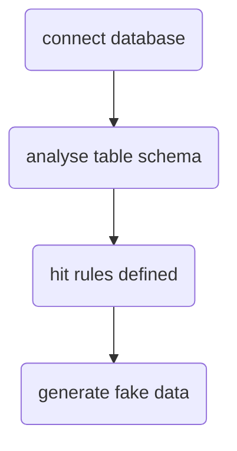

# DataFaker

Make fake data for database

*Runtime logic*

```mermaid
graph TD
    connect("connect database")
    analyse("analyse table schema")
    hit("hit rules defined")
    generator("generate fake data")
    
    connect-->analyse-->hit-->generator
```

## Rules
- Primary Key -> Foreign key
- Same field name
- CamelCase for field